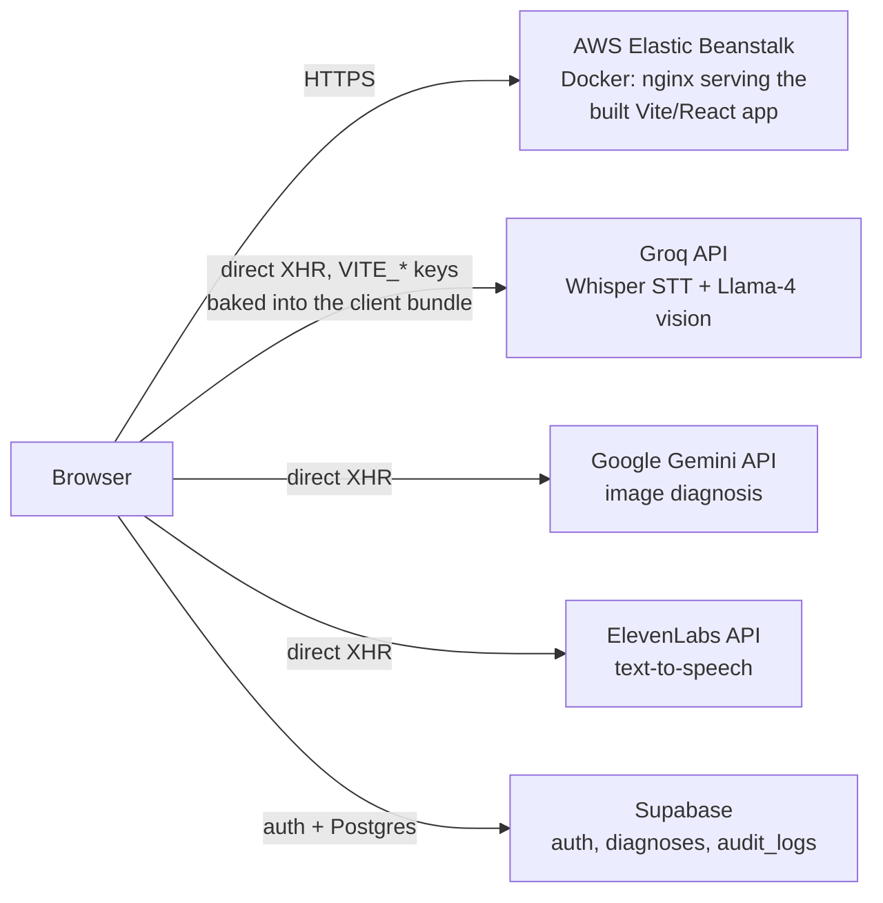

# med-ai — Architecture & Deployment (Zero to Shipped)

Repo: https://github.com/Bharathkumar1123542/med-ai

med-ai is a voice- and image-based AI health-assistant SPA: a patient records a
question and/or uploads a photo, and the app returns a spoken, conversational
preliminary assessment.

## Architecture

This is a client-rendered SPA (Vite + React + TypeScript + Tailwind, routed with
`react-router-dom`). There is no application server in the request path — the
browser talks to Groq, Gemini, ElevenLabs and Supabase directly. The only thing
AWS hosts is the static build output.

A `backend/` folder in the repo (a standalone Gradio app using the same Groq/
ElevenLabs calls) is an earlier local prototype — it isn't wired into the
production frontend and isn't part of this deployment.

## AWS services used

| Service | Role |
|---|---|
| **Elastic Beanstalk** (Docker platform, single-instance) | Runs the container, manages the EC2 instance, health checks, and the public URL |
| **EC2** | The underlying instance EB provisions |
| **S3** | Stores the Elastic Beanstalk application-version bundles |
| **CloudWatch** | EB environment health and instance logs |
| **IAM** | Default EB service role + EC2 instance profile |

Docker + Elastic Beanstalk was picked because it matches the deployment paths
AWS names for this hackathon, it's fully scriptable through the CLI (no manual
console clicking required), and `eb create` ships a public `*.elasticbeanstalk.com`
URL in one command.

## How this was shipped

1. Claude reviewed the existing `med-ai` repo (frontend stack, the three AI
   API integrations, Supabase schema) and produced the artifacts in this
   bundle: `Dockerfile`, `nginx.conf`, `.ebignore`, and `deploy.sh`.
2. `deploy.sh` is the full pipeline: confirm AWS identity → `npm run build` →
   `eb init` → `eb create`/`eb deploy` → `eb status` for the live URL.
3. _(Fill in once run)_: executed via **[Claude Code / AWS CloudShell — say
   which]**, against AWS account **[account id / alias]**, in region
   **[region]**.

### Capturing proof of the coding-agent ↔ AWS Console connection

Save these as screenshots or terminal transcripts for the Builder Center post:
- Output of `aws sts get-caller-identity` (shows the authenticated account).
- The `eb create` (or `eb deploy`) run, including the agent's own commands if
  you ran this through Claude Code.
- Final `eb status` output showing `Status: Ready`, `Health: Green`, and the
  `CNAME`.
- A screenshot of the live app at that URL.
- Optional: the Elastic Beanstalk environment dashboard in the AWS Console,
  showing the same environment/health/URL.

## Known limitation worth stating up front

The three AI provider keys (`VITE_GROQ_API_KEY`, `VITE_GEMINI_API_KEY`,
`VITE_ELEVENLABS_API_KEY`) are compiled into the client-side JS bundle by Vite,
so they're visible to anyone who inspects the deployed site. That's fine for a
hackathon demo; before any real use, those calls should move behind a small
Lambda + API Gateway proxy (or an Elastic Beanstalk endpoint) that holds the
keys server-side instead.

## Submission fields to fill in

- **Category / lane:** _community or startup, and which of the five app
  categories this fits_
- **Live app URL:** _from `eb status` → CNAME_
- **AWS account used:** _account id or alias_
